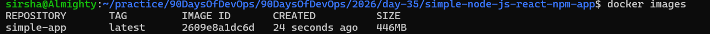
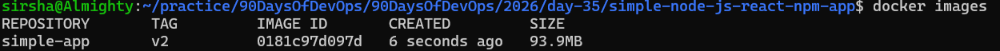
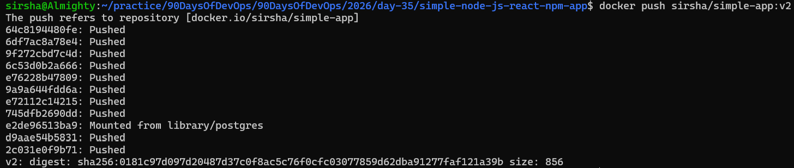
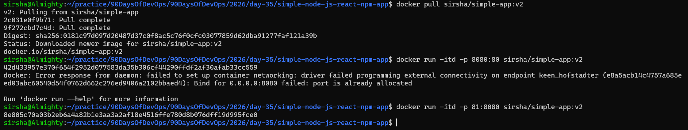
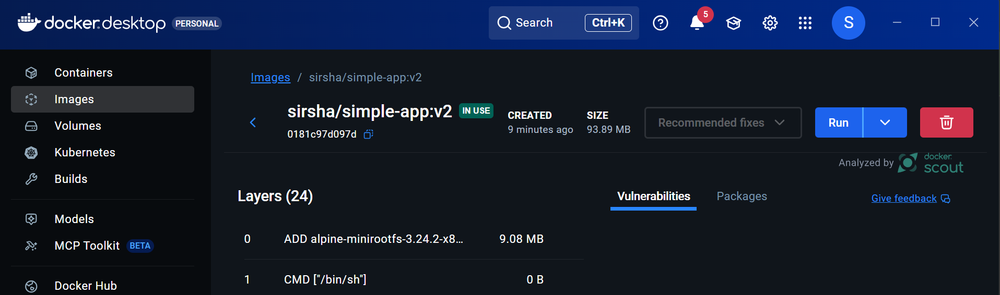
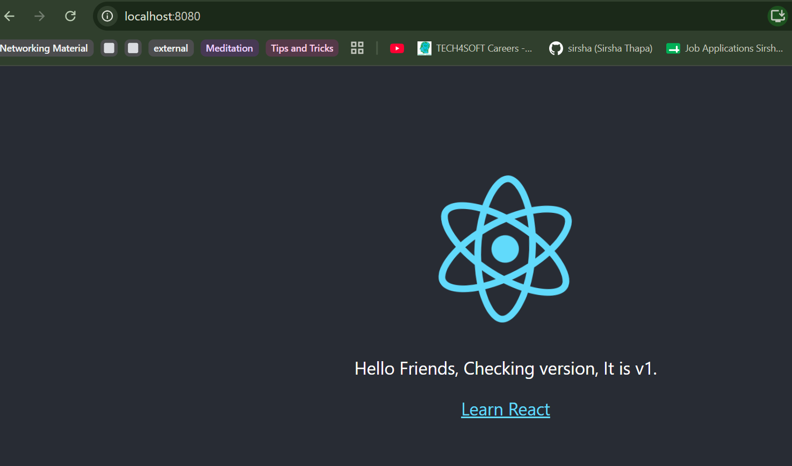
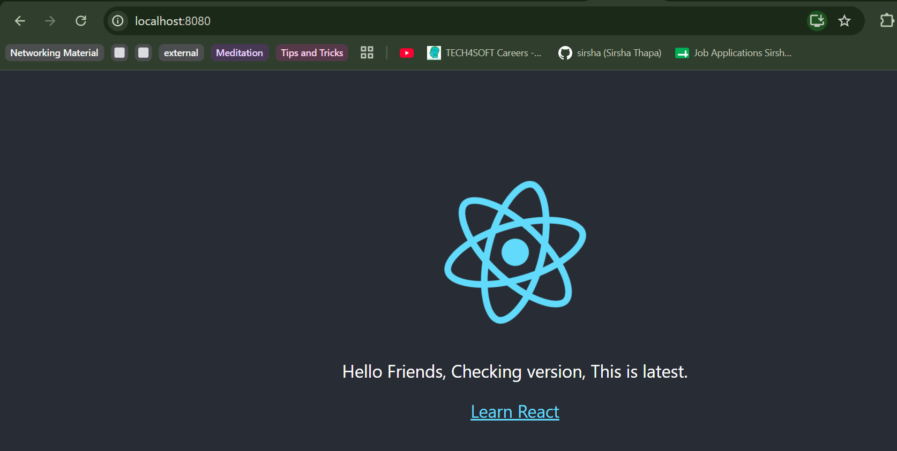

# Day 35 – Multi-Stage Builds & Docker Hub

## Task 1: The Problem with Large Images

### PROJECT FOLEDER

   [simple-node-js-react-npm-app](simple-node-js-react-npm-app)

   [Docker File](simple-node-js-react-npm-app/Dockerfile)

1. Write a simple Go, Java, or Node.js app (even a "Hello World" is fine)
2. Create a Dockerfile that builds and runs it in a **single stage**
3. Build the image and check its **size**

   

---

## Task 2: Multi-Stage Build
1. Rewrite the Dockerfile using **multi-stage build**:
   - Stage 1: Build the app (install dependencies, compile)
   - Stage 2: Copy only the built artifact into a minimal base image (`alpine`, `distroless`, or `scratch`)
2. Build the image and check its size again
3. Compare the two sizes
* Before it was 288MB, after multistage build it reduced to 62.3MB.
* Multi-stage builds are smaller because they seperate build stage from runtime,
   build contains all files, runtime contains only files that are needed to run the app.

   

---

## Task 3: Push to Docker Hub
1. Create a free account on [Docker Hub](https://hub.docker.com) (if you don't have one)
2. Log in from your terminal
3. Tag your image properly: `yourusername/image-name:tag`
4. Push it to Docker Hub

   

5. Pull it on a different machine (or after removing locally) to verify

   

---

## Task 4: Docker Hub Repository
1. Go to Docker Hub and check your pushed image
2. Add a **description** to the repository
3. Explore the **tags** tab — understand how versioning works
4. Pull a specific tag vs `latest` — what happens?
    * Specific tag pulls specific version, latest pull newest version. 

   

   * This is version-1.

   

   * This is latest.

   

---

## Task 5: Image Best Practices

### PROJECT FOLEDER

   [java-hello-world-webapp](java-hello-world-webapp)
   
   [Docker File](java-hello-world-webapp/Dockerfile)

1. Use a **minimal base image** (alpine vs ubuntu — compare sizes)
2. **Don't run as root** — add a non-root USER in your Dockerfile
3. Combine `RUN` commands to **reduce layers**
4. Use **specific tags** for base images (not `latest`)

* Size Before : 445MB
* Size after : 303MB

---

## How it actually works

Docker starts container
        ↓
catalina.sh run
        ↓
Tomcat starts
        ↓
Tomcat looks at webapps/
        ↓
finds java-hello-world.war
        ↓
Tomcat deploys the WAR
        ↓
Your Java web application runs
        ↓
Tomcat listens on port 8080
